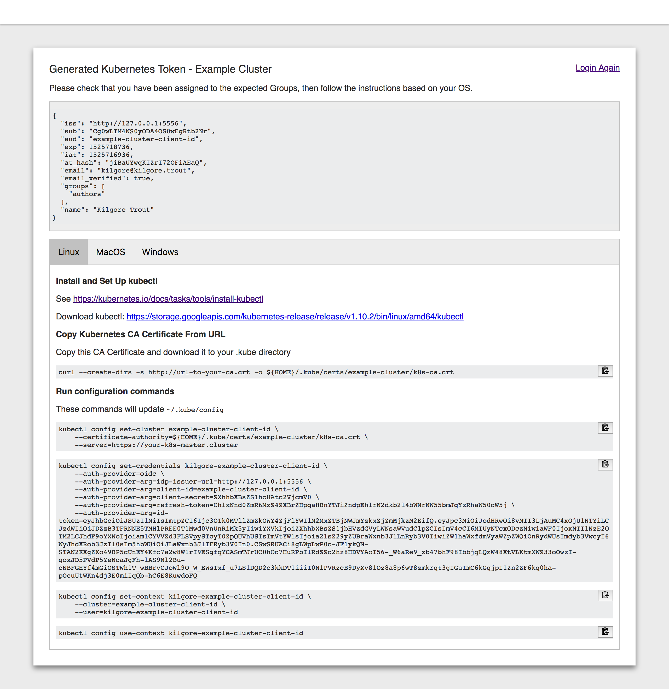

# Dex K8s Authenticator

A helper web-app which talks to one or more [Dex Identity services](https://github.com/coreos/dex) to generate
`kubectl` commands for creating and modifying a `kubeconfig`.

* The Web UI supports generating tokens against multiple clusters
    * Dev / Staging / Production etc
* Generates appropriate `kubectl config` commands (user/cluster/context)
* SSL Support

## Screen shots

## Building a binary

    make 
    
Creates ./bin/dex-k8s-authenticator

## Building a container

    make container

## Running 

### Start Dex Server instance

Follow the example here:
https://github.com/coreos/dex/blob/master/Documentation/getting-started.md

Start it with using the provided `./examples/dex-server-config-dev.yaml`

### Start Dex K8s Authenticator

    ./bin/dex-k8s-authenticator --config ./examples/config.yaml

* Browse to http://localhost:5555
* Click 'Example Cluster'
* Click 'Log in with Email'
* Login with `admin@example.com` followed by the password `password`
* You should be redirected back to the dex-k8s-authenticator

## Deploying using Helm

This project provides [`helm` charts](charts) for deploying both `dex` and
`dex-k8s-authenticator` to your Kubernetes cluster. Instructions are provided
for each chart.

## Multiple Clusters

You can run multiple Dex Server instances with different backends if required.

Just update the `examples/config.yaml` to add an extra cluster to the list with the 
required settings.

## SSL

You can update the Dockerfile and add any required root-certs to `/usr/local/share/ca-certificates/`, then run `update-ca-certificates`

## Alternatives

A similar web UI that generates `kubectl` configurations without using `dex` to authenticate first
* https://github.com/negz/kuberos

OIDC helpers that run locally to setup `kubectl`:
* https://github.com/micahhausler/k8s-oidc-helper
* https://github.com/coreos/dex/tree/master/cmd/example-app

A Kubernetes JWT webhook helper with a similar UX to Kuberos
* https://github.com/negz/kubehook
